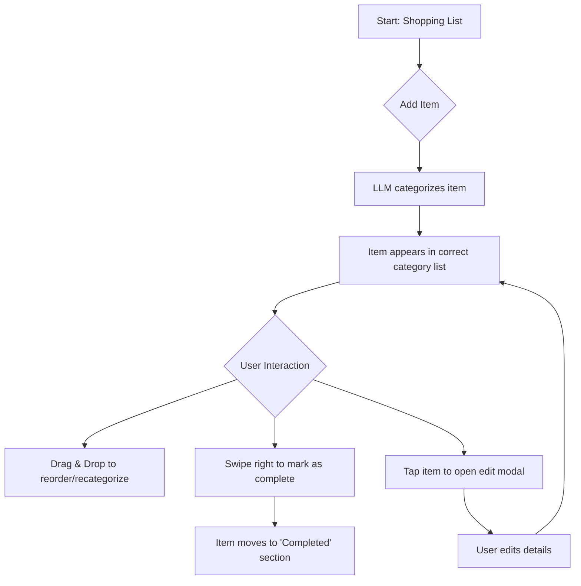

# Decision: Refine Categorical UI for Shopping Lists

## Overview
This decision outlines the approach to implementing categorical organization for shopping lists in the mobile-first PWA. Categories (e.g., Produce, Dairy, Meat) will help users scan and complete lists efficiently, aligned with store layouts for quick shopping. The UI must support touch interactions, drag-to-reorder, and sync with realtime collaboration.

## Options
- **Option 1: Fixed Categories with Drag-and-Drop Reordering**
  - Predefined categories based on common grocery layouts (Produce, Dairy, Bakery, Meat, Frozen, etc.).
  - Users can drag items between categories; categories are collapsible accordions.
  - Integration: Auto-categorize new items via LLM or user input.

- **Option 2: User-Customizable Categories**
  - Allow users to create/edit categories (e.g., add "Garden Fresh" for home-grown items).
  - Supports favorites or presets, with drag-to-reorder within and between categories.
  - Integration: Sync custom categories across devices via Supabase.

- **Option 3: Hybrid with Store Layout Mapping**
  - Fixed base categories mapped to user-selected store (e.g., Whole Foods vs. Local Market).
  - AI-assisted sorting based on inventory/shopping history; manual overrides via swipe gestures.

## Pros/Cons
- **Fixed Categories**:
  - Pros: Simple, fast setup; consistent for multiuser sharing; reduces decision fatigue.
  - Cons: Less flexible for unique needs (e.g., dietary-specific groups); may not fit all stores.

- **User-Customizable**:
  - Pros: Personalized; adapts to user habits (e.g., keto-focused categories).
  - Cons: Complexity in UI for editing; potential sync conflicts in collaboration.

- **Hybrid**:
  - Pros: Balances simplicity and personalization; leverages LLM for smart defaults.
  - Cons: Requires store data integration; higher dev effort for mapping.

## Phased Approach to Hybrid Model
To achieve the power of the Hybrid model (Option 3) without initial over-engineering, we will adopt a three-phase approach. This allows us to deliver value quickly while building towards the final vision.

### Phase A: Foundational MVP (The Heist Prep)
This phase mirrors **Option 1** and focuses on core functionality.
- **UI:** Fixed, predefined categories (e.g., Produce, Dairy, Protein, Pantry, Frozen, General).
- **Interactions:**
    - Drag-to-reorder items within and between categories.
    - Swipe-to-checkoff.
    - Tap to edit.
- **Intelligence:** Basic LLM-powered categorization on item creation, with manual override.
- **Goal:** Launch a solid, usable feature that covers 80% of user needs.

### Phase B: User-Centric Enhancements (The Getaway)
This phase introduces elements of **Option 2** to add flexibility.
- **Features:**
    - **Custom Categories:** Allow users to create, rename, and delete their own categories.
    - **Category Reordering:** Users can reorder the category sections themselves to match their personal shopping flow.
- **Data Model:** The `shopping_list_categories` table will need to support user-specific entries and ordering.
- **Goal:** Increase personalization and adapt the tool to individual user habits.

### Phase C: Smart, Context-Aware UI (The Big Score)
This is the full realization of **Option 3**.
- **Features:**
    - **Store Layout Mapping:** Users can optionally select a grocery store. The app will reorder the categories to match that store's known layout.
    - **Smart Suggestions:** The LLM can learn from user corrections and past shopping history to improve automatic categorization.
- **Integration:** Requires a data source for store layouts. This could start with a few major chains and expand over time.
- **Goal:** Create a hyper-efficient, "smart" shopping list that minimizes time spent in the store.

---

## Final Decision: Phased Approach Approved

The phased approach detailed above is **approved**. Development will begin with **Phase A: Foundational MVP**.

### Phase A: UX Flow

This flow outlines the primary user interactions for the MVP.

### Accessibility Notes
- All interactive elements (drag handles, swipe zones, buttons) will be clearly labeled for screen readers using ARIA attributes.
- The UI will adhere to WCAG 2.1 AA contrast ratios.
- Keyboard navigation will be fully supported for all interactions.

## Questions for User
- What primary categories should be default (e.g., include "Pantry Staples" or focus on perishables)?
- Preferred interaction: Drag-and-drop, swipe-to-categorize, or voice input via Expo?
- How important is store-specific layout mapping (e.g., for major chains vs. local)?
- Any accessibility needs (e.g., voice-over support for categories)?

## Next Steps
Once decided, update ux-flow.md with wireframes (Mermaid diagrams) and design-system.md with component specs. Reference: [plans/ux-flow.md](../ux-flow.md), [plans/design-system.md](../design-system.md).

*Decision Finalized: Phased approach approved on 2025-09-18.*