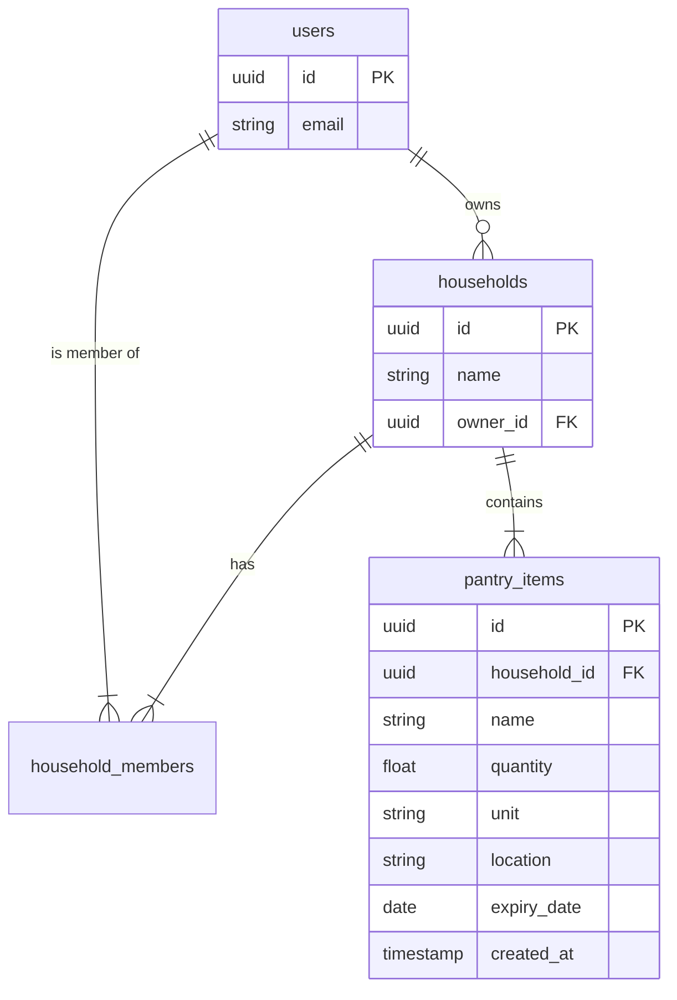

# Phase 1: Foundation & Inventory CRUD 🏗️

**Status**: � In Progress (1A ✅, 1B ✅, 1C 🚧)  
**Priority**: 🔴 Essential (MVP Blocker)  
**Estimated Effort**: 2-3 weeks  
**Dependencies**: None (this is the foundation!)  
**Blocks**: All subsequent phases

**Goal**: Establish the application shell, database schema, and core API services. Deliver a usable "Manual Inventory" app that allows users to add, edit, and remove items from their pantry.

## 1.1 Technical Architecture

### Directory Structure

```text
/
├── infra/
│   ├── docker/
│   │   ├── api.Dockerfile
│   │   ├── web.Dockerfile
│   │   └── docker-compose.yml  # Synology Stack (App + Supabase)
├── src/
│   ├── api/ (FastAPI)
│   │   ├── app/
│   │   │   ├── core/           # config.py (Env vars), logging
│   │   │   ├── db/             # session.py, base.py
│   │   │   ├── domain/         # Domain-Driven Design Modules
│   │   │   │   └── pantry/
│   │   │   │       ├── models.py    # Pydantic DTOs
│   │   │   │       ├── service.py   # Business Logic
│   │   │   │       └── repository.py# DB Access
│   │   │   └── routes/
│   │   │       └── pantry.py    # API Endpoints
│   │   └── main.py             # Entry point
│   └── mobile/ (Expo)
│       ├── app/
│       │   ├── (tabs)/
│       │   │   └── inventory/
│       │   │       ├── index.tsx       # List View
│       │   │       └── [id].tsx        # Edit/Detail View
│       │   └── _layout.tsx
│       ├── components/
│       │   └── PantryItemCard.tsx
│       └── lib/
│           ├── supabase.ts     # Supabase Client
│           └── api.ts          # Axios/Fetch wrapper for Python API
```

### Database Schema (Supabase)



## 1.2 Implementation Details (Granular Phases)

### Phase 1A: Infra & Repo Setup

- **Goal**: A running Docker stack and initialized Monorepo.
- **Tasks**:
    1. Initialize `src/api` (FastAPI + Poetry/UV).
    2. Initialize `src/mobile` (Expo + Tamagui).
    3. Create `infra/docker/docker-compose.yml`.
    4. Configure `infra/docker/api.Dockerfile` and `web.Dockerfile`.
    5. Setup `justfile` for common commands (`just up`, `just test-api`).

### Phase 1B: Backend Core & DB

- **Goal**: Functional API with Database Persistence.

- **Tasks**:

    1. **Supabase**: Define `pantry_items` table (SQL migration).

    2. **Security (RLS)**: Apply Policy: `CREATE POLICY "Isolation" ON pantry_items USING (household_id IN (SELECT household_id FROM household_members WHERE user_id = auth.uid()));`.

    3. **Domain**: Implement `PantryService` in `src/api/domain/pantry/`.

    4. **API**: Create `PantryRouter` in `src/api/routes/`.

    5. **Validation**: Add Pydantic models (`CreateItemDTO`).

### Phase 1C: Frontend Core & MVP UI

- **Goal**: A user-facing Inventory List in the Browser.
- **Tasks**:
    1. **Expo**: Setup `expo-router` in `src/mobile/app/`.
    2. **UI**: configure `Tamagui` provider.
    3. **Query**: Setup `TanStack Query` client.
    4. **Realtime**: Implement `useInventorySubscription` hook (Supabase Realtime) to listen for `INSERT`/`UPDATE`/`DELETE` on `pantry_items`.
    5. **Screens**:
        - `app/inventory/index.tsx` (List + Realtime Listener).
        - `app/inventory/add.tsx` (Modal).

## 1.3 Testing Plan

### Phase 1A Tests (Infra)

- [ ] **Command**: `docker compose up -d`
- [ ] **Verify**:
  - `api` container is healthy (curl localhost:8000/health).
  - `supabase` (or db) container is accepting connections.

### Phase 1B Tests (Backend Unit)

*Run with `pytest`*

| Test Case | Description | Input | Expected Output |
| :--- | :--- | :--- | :--- |
| `test_create_item` | Valid creation | `name="Rice", qty=1, unit="kg"` | Item created, ID returned |
| `test_create_item_negative_qty` | Validation error | `qty=-5` | `ValidationError` raised |
| `test_get_items_by_household` | RLS simulation | Household A vs B | Only returns items for A |
| `test_update_item_partial` | Partial update | `qty=2` (name unchanged) | Item updated correctly |

### Phase 1C Tests (Frontend E2E)

*Run with `Maestro` or Manual Script initially*

1. **Add Item Flow**:
    - Tap "Add (+)" button.
    - Enter "Milk", "1", "Gallon", "Fridge".
    - Tap "Save".
    - **Verify**: "Milk" appears in the list.
2. **Edit Item Flow**:
    - Tap "Milk".
    - Change Qty to "0.5".
    - Tap "Save".
    - **Verify**: List shows "0.5 Gallon".
