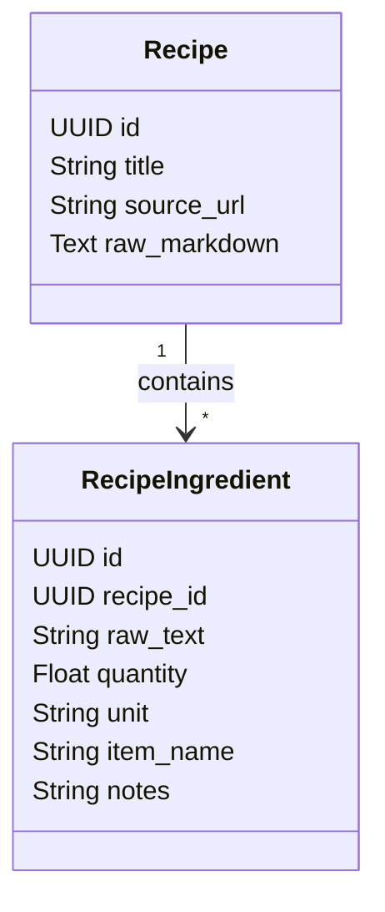

# Phase 2: The Recipe Engine 📖

**Status**: 🚧 Not Started  
**Priority**: 🔴 Essential (MVP Blocker)  
**Estimated Effort**: 2-3 weeks  
**Dependencies**: Phase 1 (Database, API structure)  
**Blocks**: Phase 3 (Delta Engine needs parsed ingredients)

**Goal**: Establish a reliable system for ingesting, storing, and *understanding* recipes. The key is parsing unstructured strings ("1 large onion") into structured data `{qty: 1, unit: "count", item: "onion"}`.

## 2.1 Technical Architecture

### Modules

- **`src/api/domain/recipes/parser.py`**: The core logic engine.
- **`src/api/domain/recipes/unit_registry.py`**: Wraps the `Pint` library for unit management.
- **`src/api/domain/recipes/ingestor.py`**: Handles Firecrawl/Scraping logic.

### Data Model

## 2.2 Implementation Details (Granular Phases)

### Phase 2A: The Ingestor & DB

- **Goal**: Fetch and store raw recipe metadata (URL, Title).
- **Tasks**:
    1. **DB**: Create `recipes` table.
        - *Note*: `raw_markdown` is optional/transient per Decision D12.
    2. **Service**: Implement `IngestorService`.
        - Wrapper around `firecrawl` (or simple `beautifulsoup` as MVP fallback).
    3. **API**: `POST /recipes/ingest { url }`.

### Phase 2B: The Parser Logic

- **Goal**: Convert unstructured text into `RecipeIngredient` rows.
- **Tasks**:
    1. **DB**: Create `recipe_ingredients` table.
    2. **Parser**: Implement `IngredientParser`.
        - **Pipeline**:
            1. Clean string (Regex).
            2. Attempt "Rule-based" extraction.
            3. Fallback to `LLMAdapter` (Gemini Flash/GPT-4o-mini) if confidence low.
    3. **Units**: Implement `UnitRegistry` (Pint) to normalize `tbsp` -> `tablespoon`.

## 2.3 Testing Plan

### Phase 2A Tests (Ingestor)

- [ ] **Integration**: `test_ingest_url`
  - Input: Valid URL.
  - Assert: Recipe created in DB, Title matches page title.

### Phase 2B Tests (Parser Unit)

*Run with `pytest`*

| Test Case | Input String | Expected JSON | Phase |
| :--- | :--- | :--- | :--- |
| `test_parse_simple_mass` | "500g Flour" | `{qty: 500, unit: "g", item: "Flour"}` | 2B |
| `test_parse_fraction_volume` | "1/2 cup Milk" | `{qty: 0.5, unit: "cup", item: "Milk"}` | 2B |
| `test_parse_complex_count` | "1 large Onion, chopped" | `{qty: 1, unit: "count", item: "Onion", notes: "large, chopped"}` | 2B |
| `test_parse_implicit_count` | "3 Eggs" | `{qty: 3, unit: "count", item: "Eggs"}` | 2B |
| `test_parse_range` | "Salt and Pepper to taste" | `{qty: 0, unit: "n/a", item: "Salt and Pepper"}` | 2B |

### Phase 2B Tests (Integration)

- [ ] **Full Flow**:
  - Input: `Ingestor` saves a recipe.
  - Action: Trigger `Parser` on that recipe.
  - Assert: `recipe_ingredients` table populates with >5 rows.
