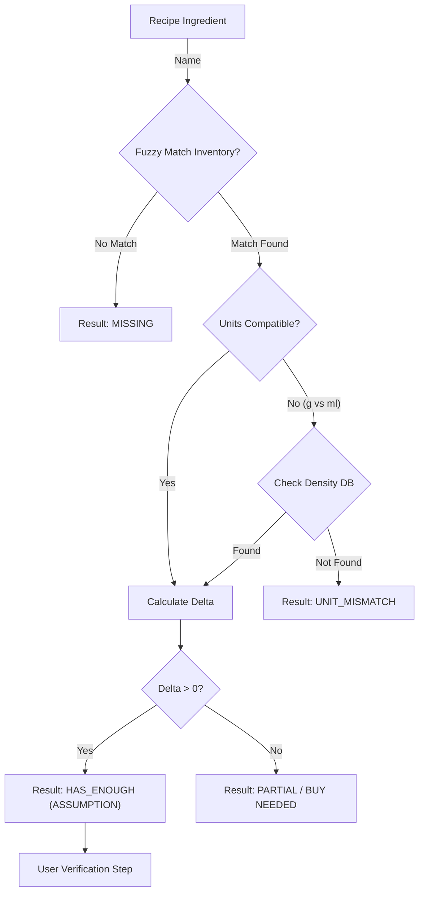

# Phase 3: The "Delta" Engine (The Math) 🧮

**Status**: ✅ Complete  
**Priority**: 🔴 Essential (MVP Blocker) - *Highest test coverage required*  
**Estimated Effort**: 2-3 weeks  
**Dependencies**: Phase 1 (Pantry data), Phase 2 (Parsed recipe ingredients)  
**Blocks**: Phase 5 (Planner needs "Can I Cook This?" logic), Phase 7 (Shopping list generation)

**Goal**: The "Brain" of the kitchen. Accurately calculate what is missing by comparing a Recipe (or Plan) against the Inventory. Crucially, it must **state its assumptions** to the user (e.g., "I assume you have Salt") before finalizing the list.

## 3.1 Technical Architecture

### Modules

- **`src/api/domain/planning/delta_service.py`**: The comparator logic.
- **`src/api/domain/planning/converter.py`**: Handles cross-unit conversions (Weight <-> Volume).

### Flowchart

## 3.2 Implementation Details (Granular Phases)

### Phase 3A: The Comparator Logic

- **Goal**: The "Math" engine. pure logic.
- **Tasks**:
    1. **Service**: Implement `DeltaService.calculate_missing()`.
    2. **Converter**: Implement `UnitConverter` (handles g <-> ml via density).
    3. **Output**: Return `MissingItem` DTOs.
    4. **Fuzzy Matching**: Simple trigram matching (pg_trgm) or Levenshtein in Python.

### Phase 3B: The Verification UI & Logic

- **Goal**: The "Human in the Loop".
- **Tasks**:
    1. **Assumption Engine**:
        - Logic to generate the `Audit` object ("We assume you have Salt").
    2. **Lazy Discovery**:
        - **API**: `POST /pantry/confirm_possession { item_name }`.
        - **Logic**: Creates a persistent `PantryItem` when user says "I have this" during verification.
    3. **UI**: The "Categorical Checklist" screen in the App.

## 3.3 Testing Plan (The "Hard Math")

### Phase 3A Tests (Comparator Unit)

| Test Case | Recipe Req | Inventory | Expected Result | Phase |
| :--- | :--- | :--- | :--- | :--- |
| `test_simple_surplus` | 2 Onions | 5 Onions | `HAS_ENOUGH` | 3A |
| `test_simple_deficit` | 5 Onions | 2 Onions | `BUY 3` | 3A |
| `test_unit_conv_success` | 500ml Milk | 1 L Milk | `HAS_ENOUGH` | 3A |
| `test_density_failure` | 1 cup Spinach | 200g Spinach | `UNIT_MISMATCH` | 3A |

### Phase 3A Tests (Property-Based)

- **Hypothesis**: `Req(x) - Inv(y) == -(Inv(y) - Req(x))`.

### Phase 3B Tests (Verification Logic)

- [ ] **Lazy Discovery**:
  - **Scenario**: User checks "I have Cumin".
  - **Action**: Call `confirm_possession("Cumin")`.
  - **Assert**: New `PantryItem(name="Cumin")` exists in DB.
- [ ] **Assumption Generation**:
  - **Scenario**: User has "Salt". Recipe needs "Salt".
  - **Assert**: Response includes "Salt" in `assumptions` list, NOT in `missing`.
