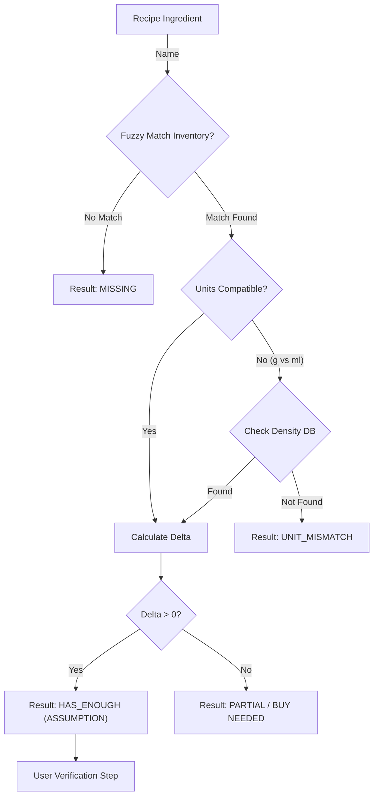

# Phase 3: The "Delta" Engine (The Math) 🧮

**Status**: 🚧 Not Started  
**Priority**: 🔴 Essential (MVP Blocker) - *Highest test coverage required*  
**Estimated Effort**: 2-3 weeks  
**Dependencies**: Phase 1 (Pantry data), Phase 2 (Parsed recipe ingredients)  
**Blocks**: Phase 5 (Planner needs "Can I Cook This?" logic), Phase 7 (Shopping list generation)

**Goal**: The "Brain" of the kitchen. Accurately calculate what is missing by comparing a Recipe (or Plan) against the Inventory. Crucially, it must **state its assumptions** to the user (e.g., "I assume you have Salt") before finalizing the list.

## 3.1 Technical Architecture

### Modules

- **`src/api/domain/planning/delta_service.py`**: The comparator logic.
- **`src/api/domain/planning/converter.py`**: Handles cross-unit conversions (Weight <-> Volume).

### Flowchart

## 3.2 Implementation Details

### The Comparator (`calculate_missing`)

- **Input**: `List[RecipeIngredient]`, `List[PantryItem]`
- **Output**: `List[MissingItem]` where `MissingItem` includes:
  - `item_name`: Canonical name.
  - `amount_needed`: The deficit.
  - `unit`: The canonical unit.
  - `status`: `MISSING` | `BUY` | `CHECK_MANUALLY`.

### 3.2.1 The Verification Step (Assumption Engine)

Before a "Shopping List" is final, we must present the "Assumed Inventory" to the user.

- **The "Audit" Object**:
  - `assumptions`: List of items we think the user *has*.
    - e.g., "Salt (Pantry)", "Olive Oil (Pantry)", "Chicken (Fridge - 2 days left)".
      - **UI Requirement**: The user must explicitly "Confirm" these assumptions. "Yes, I really do have that salt."
      - This catches the "Oh, I actually used the last of the salt yesterday" scenario.
  
  ### 3.2.2 Lazy Discovery (Implicit Inventory)
  *Decision D13: Use verification to build the pantry.*
  
  When the user is verifying *missing* items (items the DB thinks they don't have):
  1.  **Scenario**: Recipe needs "Cumin". DB says "Zero Cumin".
  2.  **User Action**: User checks the box "I actually have this".
  3.  **System Action**:
      - Temporarily marks it valid for *this* plan.
      - **Prompt**: "Add Cumin to your Pantry permanently?"
      - **Result**: If Yes, create a `PantryItem` with default quantity (e.g., "1 jar").
      - *Benefit*: The pantry grows organically as you cook, without a boring "Inventory Day".
  
  ### Density Database
  - A simple JSON/Dict fallback for common conversions.
  - `{"flour": 0.57, "sugar": 0.85}` (g/ml).

## 3.3 Testing Plan (The "Hard Math")

### Unit Tests (Logic)

| Test Case | Recipe Req | Inventory | Expected Result |
| :--- | :--- | :--- | :--- |
| `test_simple_surplus` | 2 Onions | 5 Onions | `HAS_ENOUGH` (Delta +3) |
| `test_simple_deficit` | 5 Onions | 2 Onions | `BUY 3` |
| `test_unit_conv_success` | 500ml Milk | 1 L Milk | `HAS_ENOUGH` |
| `test_unit_conv_complex` | 4 tbsp Butter | 1 stick (113g) Butter | `HAS_ENOUGH` (Needs density/alias knowledge) |
| `test_fuzzy_match` | "Kosher Salt" | "Diamond Crystal Salt" | `MATCH` (User might need to verify, but treat as match) |
| `test_density_failure` | 1 cup Spinach | 200g Spinach | `UNIT_MISMATCH` (If no density data) |

### Property-Based Tests (Hypothesis)

- Generate random quantities and units.
- Assert: `Req(x) - Inv(y) == -(Inv(y) - Req(x))`.
- Assert: Conversions are reversible (within float epsilon).
