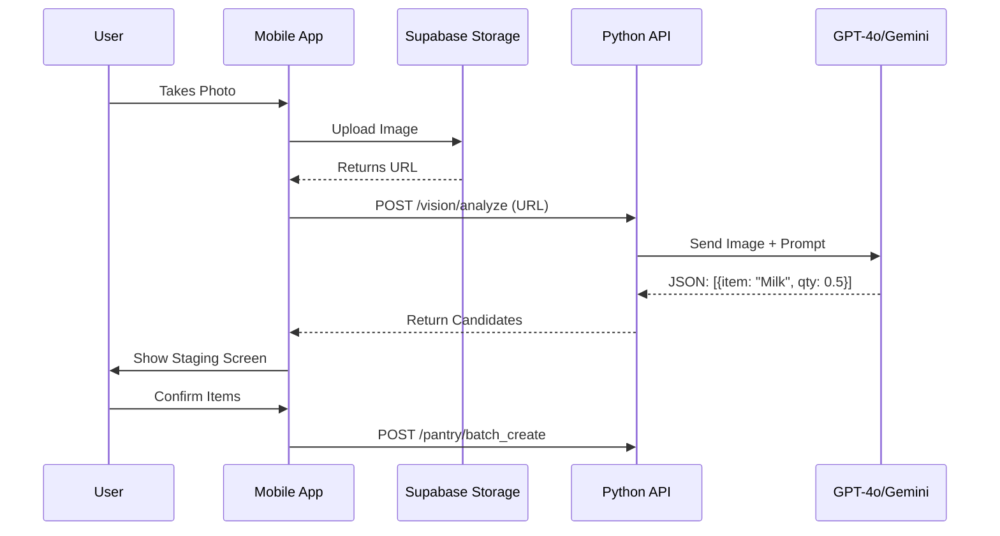

# Phase 4: Visual Pantry (Vision) 📸

**Status**: 🚧 Not Started  
**Priority**: 🟡 Nice-to-Have (Manual entry works for MVP)  
**Estimated Effort**: 1-2 weeks  
**Dependencies**: Phase 1 (Pantry CRUD to commit scanned items)  
**Blocks**: None (convenience feature)

**Goal**: Reduce data entry friction using Computer Vision.

## 4.1 Technical Architecture

### Modules

- **`src/api/domain/vision/service.py`**: Handles interaction with Vision LLM.
- **`src/mobile/app/camera/`**: Camera UI and upload logic.

### Sequence Diagram

## 4.2 Implementation Details (Granular Phases)

### Phase 4A: Vision Pipeline

- **Goal**: Image in -> JSON out.
- **Tasks**:
    1. **Mobile**: Implement `CameraService` (Take photo, resize to < 1024px).
    2. **Storage**: Upload to Supabase Bucket `inbox`.
    3. **Service**: `VisionService` (Python).
        - Adapter for `Gemini 1.5 Pro` (Best for vision).
        - Prompt Engineering (JSON enforcement).

### Phase 4B: Staging UI

- **Goal**: The "Review" screen.
- **Tasks**:
    1. **Frontend**: `app/pantry/scan_result.tsx`.
    2. **State**: Local state for the "Candidate List" (Edit/Delete before commit).
    3. **API**: `POST /pantry/batch_create` to commit final items.

## 4.3 Testing Plan

### Phase 4A Tests (Integration)

- [ ] **Vision Mock**:
  - Input: Test image URL.
  - Action: Call `VisionService.analyze()`.
  - Assert: Returns list of candidates (mocked or real API check).

### Phase 4B Tests (E2E)

- **Full Flow**:
    1. **Mock**: Upload a "test_image.jpg".
    2. **Mock**: API returns `[{"name": "Apple", "qty": 3}]`.
    3. **UI**: Verify "Apple" appears in Staging List.
    4. **Action**: User changes Qty to 5 and taps "Confirm".
    5. **Verify**: Database now has "Apple" with Qty 5.
