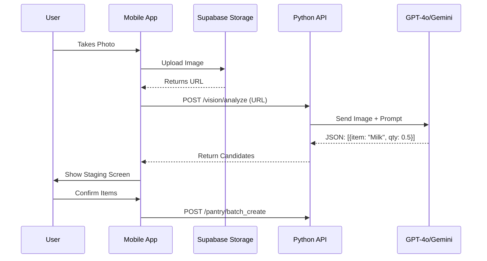

# Phase 4: Visual Pantry (Vision) 📸

**Status**: 🚧 Not Started  
**Priority**: 🟡 Nice-to-Have (Manual entry works for MVP)  
**Estimated Effort**: 1-2 weeks  
**Dependencies**: Phase 1 (Pantry CRUD to commit scanned items)  
**Blocks**: None (convenience feature)

**Goal**: Reduce data entry friction using Computer Vision.

## 4.1 Technical Architecture

### Modules

- **`src/api/domain/vision/service.py`**: Handles interaction with Vision LLM.
- **`src/mobile/app/camera/`**: Camera UI and upload logic.

### Sequence Diagram

## 4.2 Implementation Details

### The Vision Prompt
>
> "Analyze this image of a pantry/fridge. specific identify every food item visible. Estimate the quantity remaining if possible (e.g., 'half full'). Ignore non-food items. Return a JSON array: `[{name: str, estimated_qty: float, unit: str, location_guess: str}]`."

### Staging UI (`StagingScreen.tsx`)

- **Split View**:
  - Top 40%: The captured image (Zoomable).
  - Bottom 60%: List of `PantryItemCandidate`.
- **Interactions**:
  - Tap item -> Edit Name/Qty.
  - Swipe Left -> Delete (False positive).
  - Button: "Add All to Pantry".

## 4.3 Testing Plan

### Unit Tests (Backend)

- `test_vision_parsing`: Mock the LLM response with various JSON structures (valid, malformed, empty) and ensure the API handles it gracefully.

### End-to-End Tests (Mobile)

- **Mocked Vision**:
    1. Upload a "test_image.jpg".
    2. Mock API returns `[{"name": "Apple", "qty": 3}]`.
    3. Verify "Apple" appears in Staging.
    4. Click "Confirm".
    5. Verify "Apple" appears in main Inventory.
