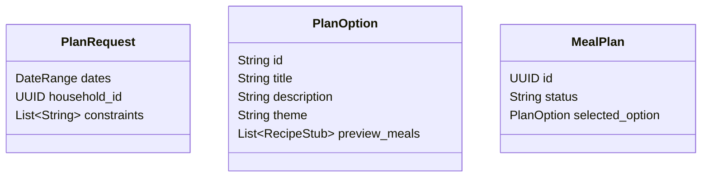

# Phase 5: The "Adventure" Planner (Core) 🎲

**Status**: 🚧 Not Started  
**Priority**: 🔴 Essential (This is the main user workflow!)  
**Estimated Effort**: 2-3 weeks  
**Dependencies**: Phase 2 (Recipes), Phase 3 (Delta/Scoring logic)  
**Blocks**: Phase 6 (Refinement), Phase 7 (Shopping list from plan)

**Goal**: The "Choose Your Own Adventure" Logic.

## 5.1 Technical Architecture

### Modules

- **`src/api/domain/planning/generator.py`**: The logic for creating Plan Options.
- **`src/api/domain/planning/scorer.py`**: Scores recipes against inventory/constraints.

### Data Model

## 5.2 Implementation Details (Granular Phases)

### Phase 5A: Generator Logic

- **Goal**: Generate 3 Thematic Options from Inputs.
- **Tasks**:
    1. **Scorer**: Implement `RecipeScorer` (Inventory % + Spoilage Weight).
    2. **Clusterer**: Logic to pick 3 distinct "Themes".
    3. **Generator**: LLM Prompt to generate the "Pitch".
    4. **Output**: Enforce **Structured JSON** for recipes (D8).
        - Schema: `{ title, ingredients: [{ item, qty, unit }] }`.

### Phase 5B: Planner UI

- **Goal**: User selects a plan.
- **Tasks**:
    1. **Screen**: `app/plan/new.tsx`.
    2. **Component**: `AdventureCard` (Title, Description, % Inventory Used).
    3. **View**: `app/plan/[id].tsx` (The 4-Day Grid View).

## 5.3 Testing Plan

### Phase 5A Tests (Generator Unit)

- [ ] **Scoring Logic**:
  - Input: Recipe using "Rotting Spinach".
  - Assert: Score > Recipe using "Canned Beans".
- [ ] **Prompt Construction**:
  - Input: `PlanRequest(constraints=["No Mushrooms"])`.
  - **Assert**: Mocked `LLMAdapter` called with prompt containing "No Mushrooms".
- [ ] **Response Parsing (Mock)**:
  - Input: Mock LLM returns JSON with 3 Themes ("Fast", "Slow", "Fun").
  - **Assert**: Service parses these into 3 `PlanOption` objects.

### Phase 5B Tests (Integration)

- [ ] **Full Flow**:
  - **Input**: User requests "4 Days, No Mushrooms".
  - **Action**: Call Generator.
  - **Verify**:
    1. UI shows 3 Cards.
    2. User selects Option A.
    3. `meal_plans` table has a new record.
    4. App navigates to Plan Detail.

### Phase 5C Tests (Frontend E2E)

1.  **Generate Plan Flow**:
    - **Go to**: `/plan`
    - **Click**: "New Plan"
    - **Fill**: Days="3", Constraints="Vegetarian"
    - **Click**: "Generate"
    - **Verify**: 3 Option Cards appear.
    - **Click**: Select Option 1.
    - **Verify**: Grid view shows 3 days of meals.

2.  **Manual Plan Entry**:
    - **Go to**: `/plan`
    - **Click**: Empty Slot on Day 1.
    - **Action**: Search for "Tacos". Select it.
    - **Verify**: "Tacos" appears in Day 1 Slot.
