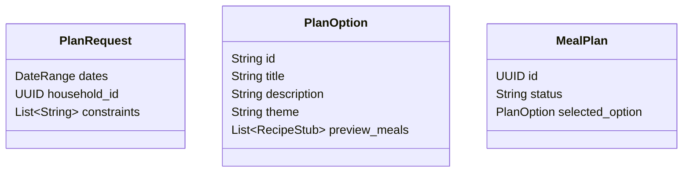

# Phase 5: The "Adventure" Planner (Core) 🎲

**Status**: 🚧 Not Started  
**Priority**: 🔴 Essential (This is the main user workflow!)  
**Estimated Effort**: 2-3 weeks  
**Dependencies**: Phase 2 (Recipes), Phase 3 (Delta/Scoring logic)  
**Blocks**: Phase 6 (Refinement), Phase 7 (Shopping list from plan)

**Goal**: The "Choose Your Own Adventure" Logic.

## 5.1 Technical Architecture

### Modules

- **`src/api/domain/planning/generator.py`**: The logic for creating Plan Options.
- **`src/api/domain/planning/scorer.py`**: Scores recipes against inventory/constraints.

### Data Model



## 5.2 Implementation Details

### The Generator Algorithm

1. **Filter**: Get all Recipes matching hard constraints (Allergies).
2. **Score**: For each recipe, calculate:
    - `InventoryScore`: % of ingredients owned.
    - `SpoilageScore`: Uses items expiring soon?
3. **Cluster**: Select top 20 recipes. Use LLM to group them into 3 coherent "Themes" (e.g., "Fast & Fresh", "Comfort Food", "Pantry Hero").
4. **Pitch**: Generate a 1-sentence description for each theme.
5. **Structured Output**:
    - When the Planner *generates* new recipe ideas (vs selecting existing DB recipes), it must output **Structured JSON**.
    - **Do Not** output just Markdown text for ingredients.
    - **Schema**:

        ```json
        {
          "title": "Spicy Chicken Tacos",
          "ingredients": [
            { "item": "Chicken Thighs", "qty": 1.5, "unit": "lbs" },
            { "item": "Cumin", "qty": 2, "unit": "tsp" }
          ]
        }
        ```

    - This bypasses the fuzzy `IngredientParser` (Phase 2) and guarantees math-ready data for the Delta Engine.

## 5.3 Testing Plan

### Unit Tests

- `test_scorer_inventory_weight`: Ensure recipes using existing inventory get higher scores.
- `test_clustering`: (Mock LLM) Ensure 3 distinct options are returned.

### Integration Tests

- **Full Flow**:
  - Input: Request(4 days).
  - Action: Call Generator.
  - Verify: Returns exactly 3 Options. Option A contains recipes.
