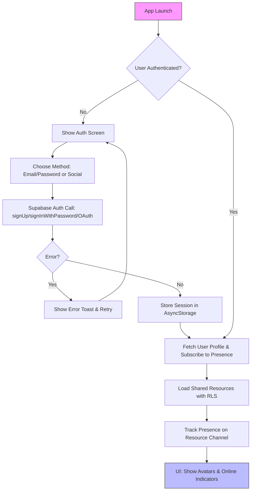

# Decision Log: User Authentication & Presence

## Table of Contents
- [1. Goal](#1-goal)
- [2. Authentication Strategy](#2-authentication-strategy)
  - [Key Features](#key-features)
  - [Options & Pros/Cons](#options-proscons)
- [3. Presence Strategy](#3-presence-strategy)
  - [Key Features](#key-features-1)
  - [Options & Pros/Cons](#options-proscons-1)
- [4. UI/UX Considerations](#4-uiux-considerations)
- [5. Row Level Security (RLS) Policies](#5-row-level-security-rls-policies)
- [6. Next Steps](#6-next-steps)

This document outlines the strategy for implementing user authentication and real-time presence indicators.

*   **Phase:** 1.5
*   **Status:** Completed (2025-09-18: Expanded RLS for all models, added social/invite flows, mobile UX details; integrated with realtime channels)
*   **Owner:** A.I. Assistant

## 1. Goal

To provide a secure and clear way for users to sign in, manage their accounts, and see who else is currently active or collaborating with them on shared resources like shopping lists.

## 2. Authentication Strategy

We will use **Supabase Auth**, leveraging its tight integration with the Supabase database and client SDKs. This simplifies development and provides a robust, secure authentication system out-of-the-box.

### Key Features:
*   **Authentication Methods:** Email/password for core; enable social providers (Google, Apple) via Supabase dashboard config (add provider keys in project settings). Supports Expo's WebView for OAuth flows on mobile.
*   **Session Management:** Supabase handles token refresh; persist sessions in AsyncStorage for Expo/React Native, with auto-sign-in on app launch.
*   **Security:** RLS enforced; add email confirmation for sign-ups to prevent spam.

### Options & Pros/Cons

#### Option 1: Email/Password + Social Logins (Recommended)
- **Description**: Core email/password with optional social providers (Google, Apple).
- **Pros**:
  - Familiar and secure for users who prefer traditional logins.
  - Social logins reduce friction for quick sign-ups, especially on mobile.
  - Supabase handles OAuth seamlessly with Expo integration.
  - Supports email confirmation to prevent spam.
- **Cons**:
  - Requires users to manage passwords (though Supabase offers magic links as alternative).
  - Social logins depend on provider availability and privacy concerns.

#### Option 2: Social Logins Only (No Email/Password)
- **Description**: Rely solely on Google/Apple for auth, no custom passwords.
- **Pros**:
  - Faster onboarding, no password creation.
  - Higher security (no password breaches).
  - Aligns with mobile ecosystem (e.g., Apple Sign-In on iOS).
- **Cons**:
  - Excludes users without social accounts.
  - Potential lock-in to providers; harder for privacy-focused users.
  - Invite flows may need email fallback for non-logged-in users.

#### Option 3: Magic Links Only (Passwordless)
- **Description**: Email-based magic links, no passwords or social.
- **Pros**:
  - Simple and secure (no stored passwords).
  - Easy for mobile (tap link in email).
  - Low friction for existing email users.
- **Cons**:
  - Requires email access every login.
  - No offline login capability.
  - Slower for frequent use compared to biometrics.

Recommended: Option 1 for flexibility, aligning with multiuser collaboration needs in brief.md.

### API Sketch (Authentication):

```javascript
// Sign up a new user
const { data, error } = await supabase.auth.signUp({
  email: 'example@email.com',
  password: 'example-password'
});

// Sign in an existing user
const { data, error } = await supabase.auth.signInWithPassword({
  email: 'example@email.com',
  password: 'example-password'
});
```

### API Sketch (Social Login & Invites):
```javascript
// Social sign-in (Google example)
const { data, error } = await supabase.auth.signInWithOAuth({
  provider: 'google',
  options: {
    redirectTo: `${window.location.origin}/auth/callback`, // For PWA/Expo
  },
});

// Invite flow: Generate shareable link or email invite
async function inviteUser(email, resourceId, role = 'editor') {
  // Insert into memberships table (requires auth.uid() as inviter)
  const { data, error } = await supabase
    .from('resource_memberships') // Generic for lists/plans/inventory
    .insert([{ user_email: email, resource_id: resourceId, role, invited_by: supabase.auth.getUser().id }])
    .select();

  if (!error) {
    // Send notification via Edge Function or email
    await supabase.functions.invoke('send-invite-email', { body: { email, resourceId, inviter: supabase.auth.getUser().user.email } });
    showToast('Invite sent!'); // Mobile-friendly toast
  }
}

// Handle invite acceptance (on link click)
const { data: user } = await supabase.auth.getUser();
if (user && invitePending) {
  await supabase.from('resource_memberships').update({ accepted: true }).eq('user_id', user.id).eq('resource_id', resourceId);
  // Redirect to shared resource and subscribe to presence channel
}
```

## 3. Presence Strategy

Supabase's built-in **Presence** feature will be used to track user online status. This allows us to build UI features that show who is currently viewing or editing a shared list.

### Key Features:
*   **Real-time Tracking:** Integrate with realtime-integration.md channels (e.g., track on 'presence-list:{list_id}'); broadcast user metadata (avatar, name) for rich indicators.
*   **UI Indicators:** Mobile-optimized: Large (60x60px) circular avatars at screen top/bottom tabs; green dot for online, pulse animation for active edits; tap to view user profile or chat (future).

### Options & Pros/Cons

#### Option 1: Supabase Presence Channels (Recommended)
- **Description**: Use Supabase's native presence for realtime tracking on resource channels.
- **Pros**:
  - Built-in, no extra setup; integrates with auth and realtime subscriptions.
  - Supports metadata (e.g., user avatar, device type) for rich UI indicators.
  - Automatic cleanup on disconnect; scales with Supabase.
  - Ties directly to RLS for secure, role-filtered views.
- **Cons**:
  - Limited to Supabase ecosystem; custom events need channel broadcasts.
  - Potential latency in high-traffic shared resources (mitigated by edge).

#### Option 2: Custom Presence via WebSockets/Polling
- **Description**: Implement manual presence using Supabase Realtime broadcasts or external service like Pusher.
- **Pros**:
  - More control over state (e.g., typing indicators, detailed activity).
  - Flexible for non-Supabase future migrations.
- **Cons**:
  - Increases complexity and maintenance.
  - Duplicates Supabase features; higher dev time.
  - Polling wastes battery on mobile.

#### Option 3: Basic Online/Offline Only (No Metadata)
- **Description**: Simple boolean tracking without user details.
- **Pros**:
  - Lightweight; minimal UI changes.
  - Easier offline handling.
- **Cons**:
  - Less engaging UX (no avatars/names).
  - Misses collaboration cues like "who is editing."

Recommended: Option 1 for seamless integration with existing realtime setup in realtime-integration.md.

### API Sketch (Presence with Mobile Ties):
```javascript
const presenceChannel = supabase.channel(`presence-resource:${resourceId}`, { 
  config: { 
    presence: { key: `user-${supabase.auth.getUser().id}` } 
  } 
});

presenceChannel.track({
  online_at: new Date().toISOString(),
  user: { id: supabase.auth.getUser().id, name: user.name, avatar_url: user.avatar_url, device: Platform.OS } // Expo Platform
});

presenceChannel.on('presence', { event: 'sync' }, () => {
  const state = presenceChannel.presenceState();
  // Filter to show only relevant users (e.g., editors)
  const activeUsers = Object.values(state).map(p => p.new);
  updateUIAvatars(activeUsers); // Render large avatars with ARIA labels
});

presenceChannel.subscribe();

// On untrack (app pause or leave)
presenceChannel.untrack();
```

## 4. UI/UX Considerations

### Authentication Flow:
*   **Screens**: Mobile-first: Full-screen modals for login/signup with large inputs (min 48px touch targets); progress spinner for OAuth redirects in Expo.
*   **Social Login**: Prominent buttons (Google/Apple icons, 100% width); handle deep links for callback in Expo via expo-auth-session.
*   **User Avatars**: Upload via Supabase Storage; default to initials icon. For invites: Share sheet with QR code/link for easy mobile sharing.

### Presence Indicators:
*   In shared views, avatars stack horizontally (scrollable if >3 users); green dot + "Online" label; for conflicts, modal alert: "User X edited item Y—view changes?" with big Yes/No buttons.
*   Typing indicators: Via presence metadata updates (e.g., { typing: true }); show "Collaborator is adding to list..." in ARIA live region.
*   Offline UX: Grayed avatars for last-seen; auto-reconnect toast on presence sync.

### Authentication Flow Diagram

This diagram outlines the mobile-first auth flow, emphasizing quick session restore and presence tie-in.

### Specific Questions for Decision
- Which auth option do you prefer: 1 (Email + Social, recommended), 2 (Social only), or 3 (Magic links only)?
- Which presence option: 1 (Supabase channels, recommended), 2 (Custom), or 3 (Basic)?
- Any additional requirements (e.g., biometric support, custom invite UX)?

## 5. Row Level Security (RLS) Policies

RLS ensures secure access; extend to all shared models with memberships table (user_id, resource_id, role).

### shopping_lists (as before)
```sql
-- Policy: Allow users to see lists they are members of.
CREATE POLICY "Enable read access for list members"
ON public.shopping_lists FOR SELECT
USING (
  auth.uid() IN (
    SELECT user_id FROM list_memberships WHERE list_id = shopping_lists.id
  )
);

-- Policy: Allow users to create new lists.
CREATE POLICY "Enable insert for authenticated users"
ON public.shopping_lists FOR INSERT
WITH CHECK (auth.role() = 'authenticated');

-- Policy: Allow list owners to update their lists.
CREATE POLICY "Enable update for list owners"
ON public.shopping_lists FOR UPDATE
USING (auth.uid() = owner_id);

```

### inventory_items Table
Users access only shared inventories they belong to.
```sql
-- Read access for members
CREATE POLICY "Enable read for inventory members" ON public.inventory_items FOR SELECT
USING (auth.uid() IN (SELECT user_id FROM inventory_memberships WHERE inventory_id = inventory_items.inventory_id));

-- Update for members (with owner override)
CREATE POLICY "Enable update for inventory members" ON public.inventory_items FOR UPDATE
USING (auth.uid() IN (SELECT user_id FROM inventory_memberships WHERE inventory_id = inventory_items.inventory_id));

-- Insert restricted to members
CREATE POLICY "Enable insert for authenticated" ON public.inventory_items FOR INSERT
WITH CHECK (auth.role() = 'authenticated' AND EXISTS (SELECT 1 FROM inventory_memberships WHERE user_id = auth.uid() AND inventory_id = new.inventory_id));
```

### meal_plans Table
Similar to shopping_lists, for collaborative planning.
```sql
-- Read/Write for plan members
CREATE POLICY "Enable access for meal plan members" ON public.meal_plans FOR ALL
USING (auth.uid() IN (SELECT user_id FROM plan_memberships WHERE plan_id = meal_plans.id))
WITH CHECK (auth.uid() IN (SELECT user_id FROM plan_memberships WHERE plan_id = meal_plans.id));
```

Enable RLS on tables via Supabase dashboard or SQL: `ALTER TABLE public.inventory_items ENABLE ROW LEVEL SECURITY;`. Test policies with Supabase's policy simulator.

## 6. Next Steps
*   Create UI wireframes for auth/presence in ux-flow.md.
*   Define memberships data model in design-system.md (e.g., ResourceMemberships with polymorphic resource_type).
*   Implement auth flows in Expo with secure storage.