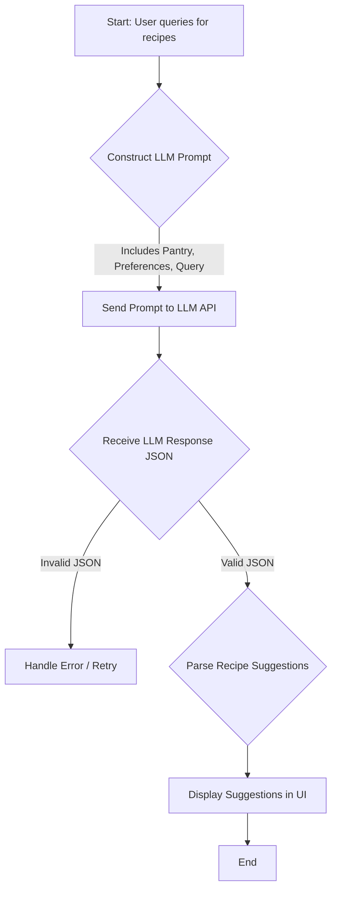

# Decision Log: Ingredient Optimization Algorithm

## Table of Contents
- [1. Problem Statement](#1-problem-statement)
- [2. Core Requirements](#2-core-requirements)
- [3. Finalized Algorithm: LLM-Powered Dynamic Suggestions](#3-finalized-algorithm-llm-powered-dynamic-suggestions)
  - [3.1. Algorithm Flow Diagram](#31-algorithm-flow-diagram)
  - [3.2. Detailed Algorithm Steps](#32-detailed-algorithm-steps)
  - [3.3. Prompt Engineering](#33-prompt-engineering)
  - [3.4. Example API Interaction](#34-example-api-interaction)
- [4. Decision &amp; Rationale](#4-decision--rationale)
- [5. Next Steps](#5-next-steps)

This document details the decision-making process for the ingredient optimization algorithm, a key feature for enhancing user experience by providing intelligent meal suggestions and reducing food waste.

*   **Phase:** 1
*   **Status:** Completed (2025-09-18: Added nutritional heuristics and integration note)
*   **Owner:** A.I. Assistant

## 1. Problem Statement

Users need a way to find recipes that make the best use of their current pantry items. The system should be able to suggest substitutions for missing ingredients, prioritizing items the user already has. This aligns with the project brief's goal of creating a "smart" kitchen assistant that minimizes waste and simplifies meal planning.

## 2. Core Requirements

*   **Pantry-First Suggestions:** The algorithm must prioritize using ingredients from the user's digital pantry.
*   **Substitution Logic:** Provide sensible substitutions for ingredients a user doesn't have.
*   **Nutritional Awareness:** (Optional, stretch goal) Factor in nutritional similarity when suggesting substitutions.
*   **Personalization:** The algorithm should align with user-defined dietary preferences.

## 3. Finalized Algorithm: LLM-Powered Dynamic Suggestions

Based on user feedback, we are pivoting to an LLM-first approach from the MVP stage. This aligns with the core vision of the app as an intelligent kitchen assistant. Instead of a rigid heuristic system, we will use a large language model to dynamically generate recipe ideas and substitutions based on the user's context.

### 3.1. Algorithm Flow Diagram



### 3.2. Detailed Algorithm Steps

1.  **Gather Context**: Collect all relevant user data:
    *   The user's full pantry list (e.g., `{'chicken breast': 2, 'rice': 1, 'broccoli': 1}`).
    *   Their dietary preferences and restrictions (e.g., `diet: 'low-carb', avoid: ['dairy']`).
    *   The user's specific query, if any (e.g., "healthy dinner ideas").
2.  **Construct Prompt**: Dynamically build a detailed prompt for the LLM. This is the most critical step and will involve careful engineering to guide the model toward the desired output. (See Prompt Engineering section below). The prompt will explicitly ask for a JSON object containing a list of recipes.
3.  **Call LLM API**: Send the constructed prompt to the chosen LLM API (e.g., OpenAI, Ollama).
4.  **Parse and Validate Response**: The LLM is instructed to return a structured JSON response. The backend will parse this JSON. If the response is malformed or invalid, the system will include error handling, potentially with a retry mechanism or a fallback response.
5.  **Present to User**: The validated recipe suggestions, including substitutions and notes, are passed to the frontend to be displayed in the user interface.

### 3.3. Prompt Engineering

The prompt is the core of this algorithm. It will be structured to constrain the LLM and ensure reliable, structured output.

**Core Components of the Prompt:**

*   **Role-Play/Persona**: "You are a helpful and creative culinary assistant."
*   **Core Task**: "Your task is to suggest 3-5 recipes based on the ingredients a user has in their pantry. Prioritize using the ingredients they already have. For any missing ingredients, suggest common substitutions if possible."
*   **Context Injection**:
    *   `USER_PANTRY`: "Here is the user's pantry: `{pantry_list_json}`."
    *   `USER_PREFERENCES`: "The user has the following dietary needs: `{preferences_json}`. Adhere to these strictly."
    *   `USER_QUERY`: "The user is looking for: `{query_text}`."
*   **Output Formatting Instructions**: "You MUST respond with ONLY a valid JSON object. Do not include any explanatory text before or after the JSON. The JSON object should follow this structure: `{\"recipes\": [{\"name\": \"...\", \"description\": \"...\", \"ingredients_used\": [\"...\"], \"missing_ingredients\": [{\"item\": \"...\", \"substitution\": \"...\"}]}]}`."

This structured approach makes the LLM's output predictable and developer-friendly.

### 3.4. Example API Interaction

**Input (Prompt sent to LLM):**
```
You are a helpful and creative culinary assistant. Your task is to suggest 3 recipes based on the ingredients a user has in their pantry...

USER_PANTRY: {'chicken breast': 2, 'rice': 1, 'broccoli': 1, 'olive oil': 1, 'garlic': 1}
USER_PREFERENCES: {diet: 'low-carb', avoid: ['dairy']}
USER_QUERY: "Healthy dinner"

You MUST respond with ONLY a valid JSON object...
```

**Output (Expected JSON from LLM):**
```json
{
  "recipes": [
    {
      "name": "Garlic Chicken & Broccoli",
      "description": "A simple and healthy low-carb meal using chicken, broccoli, and garlic.",
      "ingredients_used": ["chicken breast", "broccoli", "garlic", "olive oil"],
      "missing_ingredients": []
    },
    {
      "name": "Chicken Stir-fry",
      "description": "A quick stir-fry. You're missing soy sauce, but can use coconut aminos as a low-carb alternative.",
      "ingredients_used": ["chicken breast", "broccoli", "olive oil"],
      "missing_ingredients": [
        {
          "item": "soy sauce",
          "substitution": "coconut aminos or salt"
        }
      ]
    }
  ]
}
```

## 4. Decision &amp; Rationale

**Decision**: The LLM-Powered Dynamic Suggestion algorithm is approved for the MVP.

**Rationale**:
*   **Aligns with Vision**: This approach makes the app "LLM-first" from the beginning, matching the project's core goal.
*   **Flexibility & Creativity**: The LLM can provide much more creative and nuanced suggestions than a static heuristic system. It can understand concepts like "healthy" or "quick" without explicit programming.
*   **Reduced Data Management**: Eliminates the need to build and maintain a complex substitutions database. The LLM's general knowledge can handle this dynamically.
*   **Scalability**: The quality of suggestions can be improved over time simply by refining the prompt, without changing backend code.

## 5. Next Steps
*   LLM provider and integration method to be finalized in [plans/design-system.md](plans/design-system.md).
*   Prompt templates and logic to be added to [plans/design-system.md](plans/design-system.md) under a new "LLM Integration" section.
*   (Future) Explore fine-tuning a model for even more personalized and cost-effective results.
