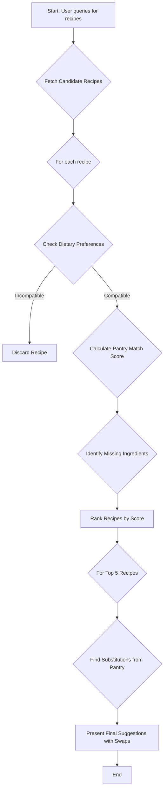

# Decision Log: Ingredient Optimization Algorithm

## Table of Contents
- [1. Problem Statement](#1-problem-statement)
- [2. Core Requirements](#2-core-requirements)
- [3. Finalized Algorithm: Heuristic-Based Similarity Score](#3-finalized-algorithm-heuristic-based-similarity-score)
  - [3.1. Algorithm Flow Diagram](#31-algorithm-flow-diagram)
  - [3.2. Detailed Algorithm Steps](#32-detailed-algorithm-steps)
  - [3.3. Pseudocode](#33-pseudocode)
  - [3.4. Nutritional Heuristics](#34-nutritional-heuristics)
  - [3.5. Example Inputs/Outputs](#35-example-inputsoutputs)
  - [3.6. Data Model for Substitutions](#36-data-model-for-substitutions)
- [4. Decision &amp; Rationale](#4-decision--rationale)
- [5. Next Steps](#5-next-steps)

This document details the decision-making process for the ingredient optimization algorithm, a key feature for enhancing user experience by providing intelligent meal suggestions and reducing food waste.

*   **Phase:** 1
*   **Status:** Completed (2025-09-18: Added nutritional heuristics and integration note)
*   **Owner:** A.I. Assistant

## 1. Problem Statement

Users need a way to find recipes that make the best use of their current pantry items. The system should be able to suggest substitutions for missing ingredients, prioritizing items the user already has. This aligns with the project brief's goal of creating a "smart" kitchen assistant that minimizes waste and simplifies meal planning.

## 2. Core Requirements

*   **Pantry-First Suggestions:** The algorithm must prioritize using ingredients from the user's digital pantry.
*   **Substitution Logic:** Provide sensible substitutions for ingredients a user doesn't have.
*   **Nutritional Awareness:** (Optional, stretch goal) Factor in nutritional similarity when suggesting substitutions.
*   **Personalization:** The algorithm should align with user-defined dietary preferences.

## 3. Finalized Algorithm: Heuristic-Based Similarity Score

For the initial implementation (MVP), we will use a straightforward, heuristic-based approach. This method avoids the complexity and cost of LLM embeddings while still providing relevant and useful suggestions. The core idea is to score recipes based on how well they match the user's pantry and then suggest substitutions for missing ingredients based on pre-defined rules.

### 3.1. Algorithm Flow Diagram



### 3.2. Detailed Algorithm Steps

1.  **Fetch Recipes**: Retrieve a pool of candidate recipes that vaguely match a user's query (e.g., "chicken dishes").
2.  **Score Recipes**: For each recipe, calculate a "pantry match score".
    *   +2 points for each ingredient that exists in the user's pantry.
    *   -1 point for each missing ingredient.
3.  **Rank Recipes**: Sort recipes from highest to lowest score.
4.  **Suggest Substitutions**: For the top-ranked recipes, identify missing ingredients.
    *   For each missing ingredient, look up potential substitutions from a pre-defined "substitutions" table (e.g., "butter" -> "margarine", "olive oil").
    *   If a viable substitution exists in the user's pantry, present the recipe to the user with the suggested swap.
5.  **Filter by Preferences**: Exclude any recipes that contain ingredients violating the user's dietary restrictions (e.g., "nuts", "dairy").

### 3.3. Pseudocode

```
function suggest_recipes(user_pantry, all_recipes, user_preferences):
    scored_recipes = []

    for recipe in all_recipes:
        score = 0
        missing_ingredients = []

        is_compatible = check_dietary_preferences(recipe, user_preferences)
        if not is_compatible:
            continue // Skip recipe if it violates preferences

        for ingredient in recipe.ingredients:
            if ingredient.name in user_pantry:
                score += 2
            else:
                score -= 1
                missing_ingredients.append(ingredient)

        recipe.pantry_score = score
        recipe.missing_ingredients = missing_ingredients
        scored_recipes.append(recipe)

    // Sort by score, descending
    sorted_recipes = sorted(scored_recipes, key=lambda r: r.pantry_score, reverse=True)

    final_suggestions = []
    for recipe in sorted_recipes[0:5]: // Top 5 suggestions
        recipe.substitutions = find_substitutions(recipe.missing_ingredients, user_pantry)
        final_suggestions.append(recipe)
        
    return final_suggestions

function find_substitutions(missing_ingredients, user_pantry, categories):
    suggested_swaps = {}
    
    // substitution_map now includes categories: {'butter': [{'sub': 'olive oil', 'category': 'fat'}, {'sub': 'margarine', 'category': 'fat'}]}
    for ingredient in missing_ingredients:
        orig_category = get_category(ingredient.name)
        possible_subs = substitution_map.get(ingredient.name, [])
        for sub in possible_subs:
            if sub['sub'] in user_pantry:
                if sub['category'] == orig_category:
                    suggested_swaps[ingredient.name] = sub['sub']
                    break // Same category preferred
                else:
                    suggested_swaps[ingredient.name] = sub['sub'] // Fallback to any available
                    break
                    
    return suggested_swaps
```

### 3.4. Nutritional Heuristics (Simple MVP)
To incorporate basic nutritional awareness without embeddings:
- **Category Matching**: Define ingredient categories (e.g., protein, carb, fat, vegetable) in the substitutions map. Prioritize subs within the same category (e.g., chicken -> turkey for proteins).
- **Score Adjustment**: For substitutions, add +1 to recipe score if sub matches category; -1 if cross-category (e.g., oil for butter is fat-for-fat, good).
- **Reference**: Aligns with [brief.md](plans/brief.md)'s personalization by allowing user-defined categories/preferences to filter.

### 3.5. Example Inputs/Outputs
**Input**:
- User Pantry: `{'chicken breast': 2, 'rice': 1, 'broccoli': 1, 'olive oil': 1, 'garlic': 1}`
- User Preferences: `{diet: 'low-carb', avoid: ['dairy']}`
- Candidate Recipes: [Recipe A: Chicken & Rice (ingredients: ['chicken breast', 'rice', 'butter', 'garlic'], category matches), Recipe B: Pasta (ingredients: ['pasta', 'cheese', 'tomato'], violates low-carb)]

**Output** (Top Suggestion):
- Recipe: Chicken & Rice
- Pantry Match Score: +5 (after category adjustment: +1 for olive oil as fat sub for butter)
- Missing: ['butter']
- Suggested Substitution: butter -> olive oil (same category: fat)
- Final Recipe Adjustments: Use 1 tbsp olive oil instead of butter; total carbs: low (rice portion reduced per prefs).

This output format enables UI display with highlighted subs and nutritional notes.

### 3.6. Data Model for Substitutions

To power the `find_substitutions` function, we'll need a simple data model, likely a table in our Supabase DB, with the following structure:

| Field             | Type    | Description                                      | Example                  |
| ----------------- | ------- | ------------------------------------------------ | ------------------------ |
| `original_item`   | `text`  | The ingredient that might be missing.            | `butter`                 |
| `substitute_item` | `text`  | A potential substitute for the original.         | `olive oil`              |
| `category`        | `text`  | Nutritional category (e.g., fat, protein).       | `fat`                    |
| `priority`        | `int`   | Rank for suggestions (lower is better).          | `1`                        |

This structure allows for flexible and ranked suggestions.

## 4. Decision &amp; Rationale

**Decision**: The Heuristic-Based Similarity Score algorithm is approved for the MVP.

**Rationale**:
*   **Feasibility**: It's simple to implement and test, aligning with our TDD practices.
*   **Performance**: The logic is fast, avoiding slow API calls to an LLM for core functionality.
*   **User Value**: It directly addresses the core user need of utilizing existing pantry items and reducing food waste.
*   **Extensibility**: The model can be expanded later with embedding-based logic for more nuanced matching without a full rewrite.

## 5. Next Steps
*   Substitutions table model created and integrated into [plans/design-system.md](plans/design-system.md) data models section.
*   Algorithm logic added to [plans/design-system.md](plans/design-system.md) under new "Ingredient Optimization" subsection.
*   (Future) Explore embedding-based models for more nuanced nutritional and flavor-profile matching.
