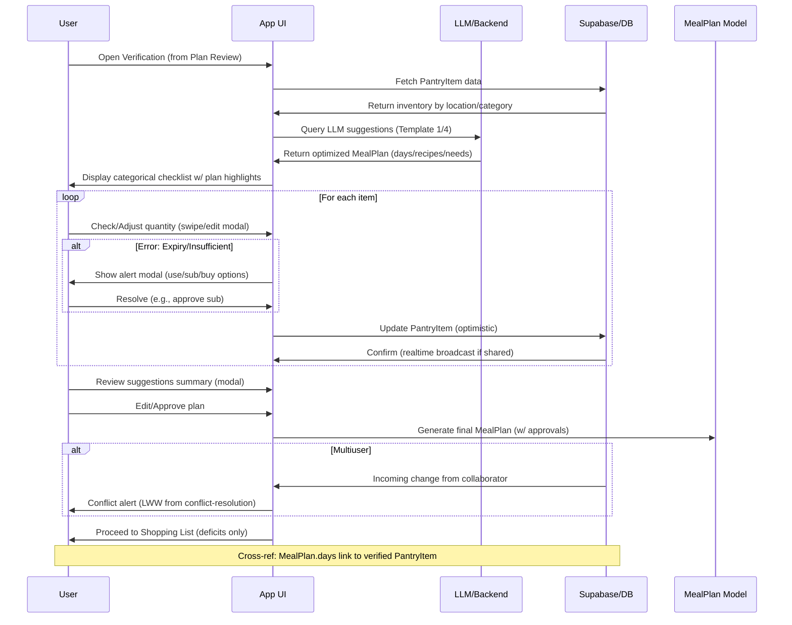
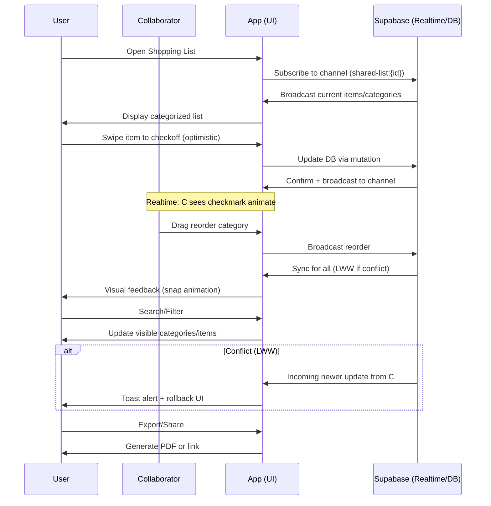

# UX Flows

## Table of Contents
- [Core Principles](#core-principles)
- [Primary Flow: Generate Meal Plan → Verify Inventory → Create Shopping List](#primary-flow-generate-meal-plan-→-verify-inventory-→-create-shopping-list)
  - [1. Initiate Meal Planning](#1-initiate-meal-planning)
  - [2. Review and Select Recipes](#2-review-and-select-recipes)
  - [3. Inventory Verification](#3-inventory-verification)
  - [4. Generate and Optimize Shopping List](#4-generate-and-optimize-shopping-list)
- [Multiuser Flows](#multiuser-flows)
- [Secondary Flows](#secondary-flows)
- [Mobile Considerations](#mobile-considerations)
- [TODOs](#todos)

This document outlines the primary user experience flows for the Personalized Dinner & Shopping App, emphasizing mobile-first design principles for on-the-go use. Flows are designed to be intuitive, with minimal navigation, large touch targets, and quick interactions. Reference [brief.md](brief.md) for feature context and [design-system.md](design-system.md) for technical alignment.

## Core Principles
- **Mobile-First**: All screens optimized for touch (e.g., 44px+ buttons), portrait orientation, thumb-friendly layouts.
- **Simplicity**: 3-4 taps max per flow; no deep menus. Use bottom navigation or gestures.
- **Offline-Capable**: Cache inventory and plans locally; sync when online.
- **Feedback**: Immediate visual cues (e.g., checkmarks for verification, loading spinners for LLM suggestions).
- **Accessibility**: High contrast, voice-over support, semantic labels.

## Primary Flow: Generate Meal Plan → Verify Inventory → Create Shopping List

### 1. Initiate Meal Planning
**Goal**: User requests a meal plan (e.g., 4 days), app suggests recipes based on inventory/garden.

**Key Screens**:
- **Home/Dashboard Screen**:
  - Large "Plan Meals" button (primary CTA, full-width, green).
  - Quick stats: Current inventory summary (e.g., "5 staples low"), garden highlights.
  - Text Wireframe:
    ```
    [Header: App Logo | Settings Icon]
    
    Welcome back! Ready to plan?
    
    [Large Button: Plan 4-Day Meals]
    
    Garden Surplus: Tomatoes (3), Basil (handful)
    Pantry Staples: Milk (full), Butter (low)
    
    [Bottom Nav: Home | Plans | Inventory | List]
    ```

**Interactions**:
- Tap "Plan Meals" → Modal for days (default 4, slider or buttons: 3/4/7 days).
- App fetches inventory → Calls backend/LLM for suggestions (e.g., "Recipes using tomatoes and leftovers").
- Loading: Spinner with "Finding efficient recipes...".

### 2. Review and Select Recipes
**Goal**: User views suggested plan, adjusts if needed.

**Key Screens**:
- **Meal Plan Review Screen**:
  - Vertical scroll of days, each with recipe card (name, prep time, key ingredients, overlap indicator e.g., "Shares 70% with Day 1").
  - Edit button per day for LLM re-suggest.
  - Text Wireframe:
    ```
    4-Day Plan (Efficient: 80% ingredient reuse)
    
    Day 1: Tomato Basil Chicken (30min)
    - Ingredients: Chicken (pantry), Tomatoes (garden), etc.
    [Edit | Approve]
    
    Day 2: Chicken Soup (20min, uses leftovers)
    - Ingredients: Leftovers from Day 1, Veggies...
    [Edit | Approve]
    
    [Button: Next - Verify Inventory]
    [Back to Home]
    ```

**Interactions**:
- Swipe to approve/edit; tap edit → LLM prompt for alternatives (e.g., "Vegetarian option using these ingredients").
- Confirm plan → Proceed to verification.

### 3. Inventory Verification
**Goal**: User confirms what's on hand via categorical checklist; app adjusts needs based on MealPlan (from design-system.md) and PantryItem data. This step includes reviewing LLM-generated recipe suggestions, editing quantities/substitutions, and approving additions to shopping list, with error handling for issues like expired items or insufficient stock.

**Key Screens**:
- **Categorical Checklist Screen** (Expanded for Confirmation):
  - Tabs/accordion for locations: Pantry | Fridge | Freezer | Garden (from PantryItem.location enum).
  - Items grouped by category, showing plan needs (e.g., "Needed: 2 tomatoes for Day 1 MealPlan").
  - For each item: Checkbox for availability, editable quantity slider, substitution suggestions (from ingredient-optimization).
  - Review section: Summary of LLM suggestions (e.g., "3 recipes use garden basil—approve?").
  - Error states: Red highlights for expiry (e.g., "Milk expires soon—use now?"), insufficient (modal: "Only 1 cup flour available (need 2)—substitute or buy?").
  - Text Wireframe (Refined for Verification):
    ```
    Verify Inventory (Plan: 4 Days, 15 Items Needed)
    
    [Tab: Pantry] [Fridge] [Freezer] [Garden]
    
    Pantry (MealPlan Days 1-3):
    - [ ] Butter (1 stick) - Needed for recipes [Sub: Olive Oil] [Slider: 0-2]
      (Expiry: Good | Error: None)
    - [x] Flour (2 cups) - In stock [Edit Quantity]
    
    Fridge:
    - [ ] Milk (1L) - Expires in 2 days [Alert: Use soon?]
    
    [Review Suggestions: 3 recipes use garden items - Edit/Approve All]
    [Search: Find ingredient...]
    [Button: Confirm Verification] (Enabled after review)
    [Back to Plan Review]
    ```

**Interactions (Detailed Verification Flow)**:
- **Review LLM Suggestions**: After initial checklist, show modal popup with LLM plan summary (from LLM Integration): "This plan uses 70% pantry—suggested subs for missing: Butter → Oil. Approve or edit?" Big buttons: "Approve Plan" (proceed to shopping) or "Edit Recipes" (back to review with highlights).
- **Edit & Approve**: Tap item → Modal for quantity/sub (e.g., "Reduce servings? Or add to shopping?"); swipe to approve individual (haptic + check animation). For multiuser, live updates show collaborator edits (e.g., "Alice confirmed tomatoes").
- **Error States & Handling**:
  - **Expiry Alert**: Items near expiry (>80% used or <3 days left) show yellow modal: "Milk expires soon—include in today's meal?" Options: "Use Now" (prioritize in plan) or "Buy More" (add to list).
  - **Insufficient Quantity**: If < needed, red banner + modal: "Only 1 tomato (need 2)—substitute with pantry onion or add to shopping?" Tie to Substitutions model; default to buy.
  - **Offline Error**: Cached checklist; on submit, queue verification (from conflict-resolution); toast: "Verified offline—sync on reconnect."
  - **Multiuser Conflict**: If collaborator changes stock during verification, realtime alert: "Inventory updated by Bob—review changes?" with diff highlights.
- **Mobile-Specific**: Modals full-screen for small devices (e.g., iPhone SE); swipe-up to dismiss edit modal; voice-over announces "Insufficient flour—tap to substitute." Ensure 48px touch targets for sliders/buttons; gesture support (pinch to zoom list if long).

**Mermaid Sequence Diagram: Meal Planning Verification Flow**


This flow ensures accurate verification, tying LLM suggestions to real inventory, with robust error handling for mobile usability and multiuser sync.

### 4. Generate and Optimize Shopping List
**Goal**: User gets a sorted, actionable list for the store, with categorical organization for quick scanning and editing in multiuser scenarios.

**Key Screens**:
- **Shopping List Screen**:
  - List sorted by store layout (Produce first, then Dairy, etc.); collapsible category headers for mobile scrolling.
  - Checkboxes to mark as bought; quantities editable via tap-to-increment or slider.
  - Export/share options (e.g., PDF, email, or share link for realtime collab).
  - Realtime multiuser: Live checkmarks propagate (from realtime-integration); presence avatars next to categories (e.g., "Bob viewing Produce").
  - Text Wireframe (Refined for Categories):
    ```
    Shopping List (Total: 12 items, ~$25 | 2 Collaborators Online)
    
    [Collapsible Header: Produce ▼]
    - [ ] Tomatoes (2) - For Day 1 [Avatar: You]
    - [ ] Onions (3)     [Swipe to check]
    
    [Collapsible Header: Dairy ▼]
    - [ ] Butter (1 stick) [Live Check by Alice]
    
    [Collapsible Header: Meat ▼]
    - [ ] Chicken (1lb)
    
    [Search: Filter items...] [Sort: By Store | By Aisle | Custom Drag]
    [Button: Mark All Bought | Share List | Export PDF]
    [Back to Plan]
    ```

**Interactions (Refined Categorical UI)**:
- **Drag-to-Reorder**: Long-press item → Drag handle appears; drag within/across categories to reorder (e.g., move "Tomatoes" to top of Produce). Use React Native Reanimated/Gesture Handler for smooth 60fps animation; visual feedback with drop shadows and snap to category boundaries. In multiuser, broadcast reorder via Supabase channel; others see animated update.
- **Swipe-to-Checkoff**: Right-swipe item → Haptic feedback + checkmark animation; left-swipe to edit quantity/notes. For categories, swipe header to collapse/expand. Optimistic update for offline (queue in conflict-resolution).
- **Category Management**: Tap header to expand/collapse; long-press to reorder categories (e.g., prioritize Dairy if low-stock alert). Search filters across categories; auto-group uncategorized items.
- **Multiuser Touches**: When collaborator checks item, show animated check + attribution (e.g., "Checked by Bob"); tap to undo if conflict (LWW alert from conflict-resolution).
- **Usability Best Practices for Touch**: All targets ≥44x44px (e.g., checkboxes 48px); thumb-friendly bottom placement for reorder/share; reduced motion mode respects device settings. Haptics on swipe/drag for confirmation; voice feedback "Item checked off" for accessibility.

**Accessibility Notes**:
- **ARIA Labels**: Category headers as `role="group" aria-label="Produce section"`; items as `role="checkbox" aria-checked="false" aria-label="Tomatoes, quantity 2, needed for Day 1"`. Reorder drag: `aria-live="polite"` announcements for position changes (e.g., "Tomatoes moved to position 1").
- **Screen Readers/VoiceOver**: Support TalkBack/VoiceOver for swipe gestures (custom handlers announce "Swipe right to check"); keyboard nav for reorder (arrow keys + Enter to move). High contrast mode for categories (e.g., colored borders); semantic HTML in React Native via react-native-aria.
- **Testing**: Validate with TalkBack simulator; ensure 100% navigable without sight (e.g., announce live updates from collaborators).

**Mermaid Flowchart: Categorical Shopping List Interactions**


This refined UI ensures efficient, collaborative shopping on mobile, aligning with brief.md's categorical sorting and multiuser realtime.

## Multiuser Flows

With the shift to realtime multiuser collaboration, we extend the single-user UX flows to support shared experiences across devices/users, while prioritizing mobile usability (e.g., large touch targets, simple alerts). Core features from brief.md (e.g., meal planning, inventory verification, shopping lists) now support collaboration.

### Inviting Collaborators
- **Flow**: From any shared resource screen (e.g., meal plan or shopping list), tap a prominent "Invite" button (large, full-width for mobile). Select contacts or enter email/share link. Confirm with a simple modal: "Invite [Name] to edit this list?" with big Yes/No buttons.
- **Realtime Aspect**: Upon acceptance (via Supabase auth), the invitee joins instantly; show live presence (e.g., avatars lighting up online).
- **Mobile Considerations**: Use device contacts integration; handle offline invites by queuing and syncing on reconnect.

### Realtime Shared Verification Checklist (e.g., Inventory/Shopping)
- **Flow**: In shared inventory or shopping list view, display items with live checkmarks. When one user checks an item (tap large checkbox), it updates instantly for all via Supabase realtime subscriptions—others see the checkmark appear/disappear in real-time.
- **UX Enhancements**: Show presence indicators (e.g., "Alice is checking off items" with animated dots); optimistic updates for offline users (check item locally, sync on reconnect; if conflict, show alert: "Another user unchecked this—review changes?" with big Reload/Keep Mine buttons).
- **Notifications**: Push alert for changes (e.g., "Bob added milk to the shopping list") via Expo Notifications, with quick-tap actions to view/update.

### Shared Meal Planning
- **Flow**: Collaborative editing of meal plans: Users add/edit recipes in real-time; changes broadcast via WebSockets. Use simple concurrent editing cues (e.g., highlight edited sections with user initials).
- **Conflict Resolution**: For overlaps, apply last-write-wins with user-friendly alerts (e.g., toast notification: "Your change overwritten by [User]—undo?"); mobile: Ensure alerts don't block screen, with swipe-to-dismiss.
- **Offline Handling**: Optimistic UI (e.g., add recipe immediately, flag as "Pending Sync" with spinner); on sync failure, simple modal with options.

### General Multiuser UX Principles
- **Presence & Awareness**: Always show collaborator count/online status in headers (e.g., "2 people viewing"); use subtle animations for live updates to avoid distraction on mobile.
- **Permissions**: Role-based UI (e.g., owners see "Remove Collaborator" button); viewers get read-only mode with live updates.
- **Exit/Leave**: Easy opt-out: Tap profile > "Leave Shared List" with confirmation.

These flows build on single-user paths, adding collaboration layers without overwhelming the mobile-first design—focus on intuitive, realtime feedback with minimal cognitive load.

## Secondary Flows
- **Inventory Management**: Standalone screen to add/update items (scan barcode or manual). Flow: Home → Inventory Tab → Add Item (dropdown for location, expiry picker).
- **Recipe Library**: Search/browse saved recipes; integrate LLM for "Similar to this with my inventory".
- **Settings**: Offline mode toggle, garden setup, store layout customization.

## Mobile Considerations
- **Gestures**: Swipe to delete/archive, pull-to-refresh inventory.
- **Performance**: Lazy-load recipe details; pre-fetch common staples.
- **Edge Cases**: Low battery mode (reduce LLM calls); no internet (use cached plan).
- **Testing**: Simulate on mobile devices; ensure flows work in 5-10 seconds.

## TODOs
- Flesh out verification flow with prototypes (link Figma).
- Test modals on devices for touch/voice-over.

References: Align with mobile-first rules in [.kilocode/rules.md](../.kilocode/rules.md).